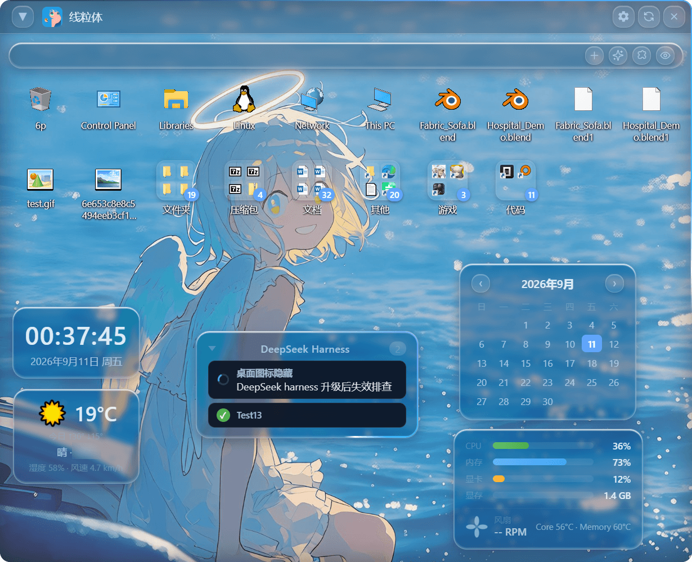
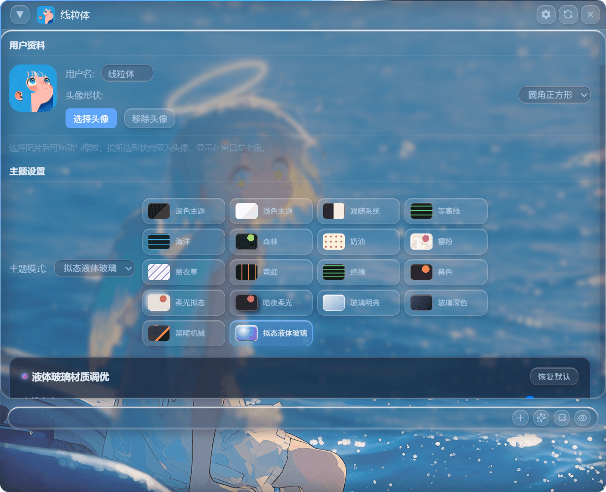

# Desktop Icon Hider

**看桌面，不用离开你正在用的软件。**

桌面图标被收进贴在屏幕边缘的一块面板里：鼠标划到边缘就滑出来，移开就自动收起。
不用按 Win+D（那会把所有窗口都最小化，你还得再一个个找回来）、不用 Alt+Tab，
也不用挨个最小化窗口 —— 只是想瞄一眼桌面上的东西时，动一下鼠标就够了。



**动效演示**（鼠标移到屏幕边缘 → 面板滑出；移开 → 自动收起）：

https://github.com/user-attachments/assets/ec664d9c-9200-4551-8a82-103523f328cb

> **和 Fences 的区别**：Fences 的重心是"把图标分组围栏"，本项目的重心是
> "把桌面变成一块随时能从屏幕边缘唤出、又会自己躲开的面板"。分组目前只有一层虚拟分区，
> 多分区仍在[计划中](#未来计划)。

## 功能特点

- 🧲 **边缘自动唤出（核心）** - 面板吸附在屏幕任一边缘：鼠标移到边缘即滑出，移开后自动缩回，
  全程不打断你正在用的软件；当前台是全屏应用（游戏 / 视频 / IDE）时自动让位不打扰。
  四条边任选，位置和高度都会记住
- 🖱️ **一键隐藏/显示桌面图标** - 通过折叠/展开虚拟分区快速管理桌面图标
- 🎯 **可拖拽窗口** - 标题栏可拖拽到任意位置
- 🔄 **实时刷新** - 文件系统监听，桌面文件变化自动更新图标
- 🔍 **快速搜索** - Ctrl+F 按文件名/扩展名实时过滤
- ✂️ **多选批量操作** - Ctrl/Shift 点击或拖框多选，批量打开/复制/剪切/删除
- 📋 **剪贴板文件操作** - Ctrl+C/X/V 在图标间复制/剪切/粘贴到桌面
- 📁 **文件夹悬停预览** - 鼠标悬停文件夹即弹出内容预览
- 📐 **自动整理规则** - 按关键词/扩展名自动归类图标到分组
- ⌨️ **自定义快捷键** - 全局快捷键可自由录制修改
- 🔒 **图标锁定** - 防止误拖拽，保护图标布局
- 🌐 **中英双语** - 支持简体中文 / English 切换
- 💾 **布局导出/导入** - JSON 快照备份与恢复
- 🚀 **开机自启动** - 支持延迟启动，避免开机抢占焦点
- 🎨 **主题/透明度/图标大小** - 深色/浅色/跟随系统，实时调节
- 💾 **状态持久化** - 自动记住窗口位置、折叠状态和所有设置

## 界面与主题



18 种外观可选（深色 / 浅色 / 跟随系统三种模式 + 拟态液体玻璃、玻璃深色、玻璃明亮、
霓虹、终端、等高线、海洋、森林、奶油、樱粉、薰衣草、暮色、柔光拟态、暗夜柔光、黑曜机械），
另有组件透明度、图标大小、字体等可调。

## 系统要求

**使用（下载安装包）**

- Windows 10 / 11（x64）
- 不需要 Node.js，也不需要任何运行库

**从源码运行 / 自行构建**

- Node.js 20 或更高版本
- Visual Studio Build Tools + Windows SDK（编译原生图标提取模块；详见[构建](#构建)）
- 建议把仓库放在纯 ASCII 路径下，路径含中文时 MSBuild 可能报 C1083

## 快速开始

### 普通使用：下载安装包

到 [Releases](https://github.com/yhkkk1234/desktop-icon-hider/releases) 下载：

- `Desktop Icon Hider-<版本>-win-x64.exe` —— 安装版（可选安装目录、建桌面/开始菜单快捷方式）
- `Desktop Icon Hider-<版本>-portable.exe` —— 便携版，双击即用

安装后启动，把鼠标移到屏幕边缘即可唤出面板；边缘位置在**设置 → 边缘自动隐藏**里选择。

### 从源码运行

```bash
npm install
npm start
```

或双击 `start.bat`。带日志的开发模式：`npm run dev`（日志同时写入
`%APPDATA%\desktop-icon-hider\logs\main.log`）

## 使用说明

### 基本操作

1. **展开/折叠**
   - 点击标题栏左侧的三角形按钮 (▼) 展开/折叠窗口
   - 展开时显示所有桌面图标
   - 折叠时只显示标题栏

2. **边缘自动隐藏（核心交互）**
   - 在设置中启用"边缘自动隐藏"并选择吸附边缘（上/下/左/右）
   - 使用时将窗口拖到屏幕边缘，鼠标移开窗口自动缩回，只露出 2 像素
   - 鼠标移到屏幕边缘，窗口自动弹出，可快速查看/操作桌面图标
   - 全程不干扰正在使用的其他软件

3. **图标多选**
   - 单击选中，Ctrl+点击 多选，Shift+点击 范围选择
   - 按住空白处拖框批量选择
   - 选中后底部工具栏支持批量打开/复制/剪切/粘贴/删除

4. **剪贴板操作**
   - Ctrl+C / Ctrl+X 复制/剪切选中图标
   - Ctrl+V 粘贴到桌面（重名自动追加编号）

5. **隐藏与恢复**
   - 双击窗口空白处隐藏/恢复全部图标
   - 拖动图标到分组栏可快速归类

### 快捷键

| 快捷键 | 功能 |
| ------ | ---- |
| Ctrl + F | 搜索图标 |
| Ctrl + Alt + D | 显示/隐藏窗口 |
| Ctrl + Alt + R | 刷新文件列表 |
| F2 | 重命名选中图标 |
| Del / Shift + Del | 移入回收站 / 永久删除 |
| F5 | 刷新 |
| Ctrl + A | 全选 |
| Ctrl + C / X / V | 复制 / 剪切 / 粘贴 |
| Ctrl + 滚轮 | 调整图标大小 |
| 双击空白 | 隐藏/显示全部图标 |

全局快捷键（Ctrl+Alt+D/R）可在设置中自定义。

### 状态保存

应用会自动保存以下状态：
- 窗口位置和大小
- 展开/折叠状态
- 开机自启动设置

下次启动时会恢复到上次的状态。

## 构建

### 构建 Windows 安装包

```bash
npm run build:win
```

构建完成后，安装包位于 `dist/` 目录。

### 构建所有平台

```bash
npm run build
```

## 项目结构

```
桌面图标隐藏/
├── src/
│   ├── main/              # Electron 主进程
│   │   ├── index.js       # 应用入口
│   │   ├── window-manager.js    # 窗口管理
│   │   └── desktop-api.js       # Windows API集成
│   ├── renderer/          # 渲染进程
│   │   ├── index.html     # 主页面
│   │   ├── styles.css     # 样式文件
│   │   └── renderer.js    # UI逻辑
│   ├── preload/           # 预加载脚本
│   │   └── preload.js     # IPC桥接
│   └── utils/             # 工具函数
│       ├── logger.js      # 日志系统
│       ├── config.js      # 配置管理
│       ├── error-handler.js  # 错误处理
│       └── icon-helper.js # 图标辅助函数
├── __tests__/             # 测试文件
├── build/                 # 构建资源
├── package.json           # 项目配置
├── electron-builder.yml   # 构建配置
├── AGENTS.md              # 开发指南
├── CHANGELOG.md           # 变更日志
├── CONTRIBUTING.md        # 贡献指南
└── README.md              # 本文件
```

## 技术栈

- **Electron 43** - 桌面应用框架
- **Node.js** - 后端运行时
- **原生插件（node-addon-api）** - `icon_extractor.node` 负责图标提取，取代早期的 ffi-napi
- **C# P/Invoke（经 PowerShell 内联编译）** - 桌面图标窗口的显示/隐藏（`FindWindow` 系列 + `ShowWindow`）
- **PowerShell + LibreHardwareMonitor** - 性能监控采样（温度 / 风扇 / 显存）
- **better-sqlite3** - 只读第三方 agent 会话库（opencode / ZCode），未安装时静默降级
- **electron-store** - 状态持久化
- **自建注册表方案** - 开机自启动（不使用 electron-auto-launch，原因见 `src/main/tray.js` 注释）

## 环境变量

本应用**不读取 `.env` 文件**（没有引入 dotenv），也不依赖任何必填环境变量。
以下为可选的运行时变量，在系统环境里设置即可；未设置时各数据源按默认路径工作。

| 变量 | 作用 | 未设置时 |
|---|---|---|
| `DSH_HOME` | DeepSeek Harness 数据目录 | `~/.dsh` |
| `ZCODE_HOME` | ZCode 数据根目录 | `~/.zcode/cli/db/db.sqlite` |
| `OPENCODE_SERVER_USERNAME` | `opencode serve` 的 Basic 认证用户名 | 空（不认证） |
| `OPENCODE_SERVER_PASSWORD` | 同上，密码（仅自跑 serve 时用于状态校准通道） | 空（不认证） |

其余配置（主题、组件位置与尺寸、agent 组件的数据目录与端口、开机自启等）都在应用内的
**设置面板**修改，由 electron-store 持久化到
`%APPDATA%\desktop-icon-hider\desktop-icon-hider.json`。

> 开发版与打包版共用同一个 userData 目录：Electron 的 `app.getName()` 取的是
> `package.json` 的 `name`（`desktop-icon-hider`），而 `electron-builder.yml` 里的
> `productName`（`Desktop Icon Hider`）只影响 exe/安装包/快捷方式的显示名，
> 不会改变这个路径。

## 开发命令

```bash
# 启动应用
npm start

# 启动开发模式（带日志）
npm run dev

# 运行代码检查
npm run lint

# 运行测试
npm test

# 构建Windows版本
npm run build:win

# 构建所有平台
npm run build
```

## Windows API集成

窗口类 API 由内联 C# 经 PowerShell 编译后 P/Invoke 调用（见 `src/main/index.js`），
图标提取由原生插件完成（见 `src/native/icon_extractor.cc`、`binding.gyp`）。
实际使用的 API：

1. **FindWindowW / FindWindowExW** - 定位桌面图标宿主窗口（`SHELLDLL_DefView`，Win11 起可能挂在 `WorkerW` 下，代码会回退枚举）
2. **ShowWindow** - 显示/隐藏该窗口（即"隐藏桌面图标"的实现）
3. **SetWindowPos** - 应用窗口自身的位置与层级
4. **GetWindowRect** - 取窗口矩形（多显示器与吸附判断）
5. **SHGetFileInfo / ExtractIconEx / DrawIconEx** - 提取并绘制文件图标（原生插件内，配合 gdiplus）

## 故障排除

### 桌面图标无法隐藏

如果图标无法隐藏，请尝试：

1. **以管理员身份运行**
   - 右键应用图标，选择"以管理员身份运行"

2. **检查Windows版本**
   - 确保使用Windows 10/11

3. **查看日志**
   - 应用内：**设置 → 关于 → 打开日志文件夹**
   - 手动：`%APPDATA%\desktop-icon-hider\logs\main.log`（自动滚动，保留 `main.log.1~.3`）
   - 开发模式另可运行 `npm run dev` 直接看控制台输出
   - 报告问题时请附上该日志：主进程的 `console.warn/error`、未捕获异常与未处理 Promise
     拒绝都会写进去

### 窗口显示异常

1. 重启应用
2. 删除配置文件（`%APPDATA%\desktop-icon-hider\desktop-icon-hider.json`）
3. 重新启动应用

### 依赖安装失败

1. 清除npm缓存：`npm cache clean --force`
2. 删除node_modules文件夹：`rm -rf node_modules`
3. 重新安装：`npm install`

### 原生模块（icon_extractor / better-sqlite3）问题

原生模块必须针对 Electron 的 ABI 重新编译，用 Node 直接编译出来的版本在应用里无法加载：

1. 安装 Visual Studio Build Tools 与 Windows SDK
2. 运行：`npm run rebuild-native`
3. 完整重新编译（含图标提取插件、硬件监控库、better-sqlite3）：
   `powershell -ExecutionPolicy Bypass -File build-native.ps1`

`npm install` 时原生模块由 `scripts/native-build.js` 自动编译：它会探测本机已装的
Windows SDK 版本再交给 node-gyp。若编译失败，安装不会中断（应用仍可启动，但桌面图标
会退化为 emoji 占位），并会打印排查提示。也可以手动指定 SDK 版本：

```powershell
# 版本号见 C:\Program Files (x86)\Windows Kits\10\Include
$env:GYP_DEFINES = 'win_sdk_version=10.0.26100.0'; npm run rebuild-native
```

> 注意：项目路径含中文时 MSBuild 可能报 C1083 找不到源文件，
> 建议把仓库放在纯 ASCII 路径下（这也是 `scripts/rebuild-better-sqlite3.ps1` 里记录过的坑）。

### 性能监控无数据 / 风扇转速恒为 `-- RPM`

1. 采样依赖 `native/hardware/` 下的 LibreHardwareMonitorLib；若缺失请运行 `build-native.ps1`
2. 风扇转速只在读数 `> 0` 时上报（见 `src/main/hardware-sampler.ps1`），
   显卡零转停转（风扇停转）期间显示 `-- RPM` 属正常现象

## 已知问题

1. **Windows版本兼容性**
   - 在某些Windows版本上，图标隐藏功能可能需要管理员权限

2. **性能**
   - 首次加载桌面图标可能需要几秒钟

3. **第三方主题**
   - 使用第三方桌面主题可能导致窗口显示异常

## 未来计划

- [ ] 支持多个虚拟分区
- [ ] 图标搜索功能
- [ ] 全局快捷键支持（如自定义折叠/展开快捷键）
- [ ] 图标筛选功能（按类型、大小等过滤）
- [ ] 图标拖拽重新排列

## 许可证

MIT License（见 [LICENSE](LICENSE)）。

发行包内还包含第三方组件，其许可见 [THIRD_PARTY_NOTICES.md](THIRD_PARTY_NOTICES.md)：
LibreHardwareMonitorLib（MPL-2.0）与 HidSharp（Apache-2.0）。

## 贡献

欢迎提交问题和拉取请求！详见 [CONTRIBUTING.md](CONTRIBUTING.md)。

## 联系方式

如有问题或建议，请通过GitHub Issues联系。
